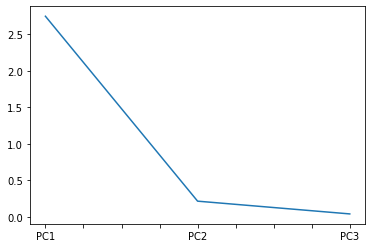

# Csődelőrejelzés Többáltozós Statisztikai Módszerekkel
A csődelőrejelzés alapvető célja csődvalószínűség, illetve fizetőképességet kifejező score becslése az egyes megfigyelésekhez a magyarázó változók (pénzügyi mutatók) és a csődeseményt kifejező bináris célváltozó felhasználásával.

## Adattömörítés és klaszterezés a csődmodell adatbázison

Annak érdekében, hogy modellezési célváltozó nélkül megfelelően csoportosíthassuk a pénzügyi arculat szempontjából eltérő tulajdonsággal rendelkező vállalatokat, szükséges az első lépésben elkészített csődmodellezési adatbázison a pénzügyi mutatók adattömörítésének elvégzése főkomponenselemzés segítségével, majd a főkomponensek felhasználásával a vállalatok klaszterezése. Ennek érdekében a következő feladatokat kell elvégezni:

**1. Az előző lépésben létrehozott pénzügyi mutatók adattömörítése főkomponenselemzés segítségével** <br>
**2. A főkomponensértékek alapján a vállalatok klaszterezése k-közép algoritmussal** <br>
**3. Diszkriminanciaanalízis segítségével a fentiekben elvégzett klaszterezés statisztikai megfelelőségének tesztelése**

A kiinduló adatbázist az elősző lépésben előállított `database.xlsx` file-ból olvassuk be egy dataframe-be.


```python
from factor_analyzer.factor_analyzer import calculate_bartlett_sphericity
from factor_analyzer.factor_analyzer import calculate_kmo
from sklearn.preprocessing import StandardScaler
from sklearn.decomposition import PCA
from sklearn.cluster import KMeans
from scipy.stats import pearsonr
import matplotlib.pyplot as plt
import numpy as np
import pandas as pd


pd.options.display.float_format = '{:.3f}'.format

database = pd.read_excel('database.xlsx', index_col=0)

database.head()
```


<div>
<table class="dataframe">  <thead>
    <tr style="text-align: right;">
      <th></th>
      <th>ROE</th>
      <th>ROA</th>
      <th>EBITDA</th>
      <th>ROS</th>
      <th>ARBEV_ARANYOS_EBITDA</th>
      <th>ESZK_ARANYOS_ARBEV</th>
      <th>KESZLET_FORG_SEB</th>
      <th>VEVO_FORG_SEB</th>
      <th>LIKVID_RATA</th>
      <th>LIKVID_GYORSRATA</th>
      <th>...</th>
      <th>CASH_FLOW_ARBEV_RATA</th>
      <th>MFO_NAGYSAG</th>
      <th>ARBEV_NAGYSAG</th>
      <th>ARBEV_NOVEK</th>
      <th>TOKE_ELLAT</th>
      <th>FORGO_ESZK_ARANYA</th>
      <th>LIKVID_PENZESZK_ARANYA</th>
      <th>FORGO_TOKE_ARANY</th>
      <th>VEVO_SZALLITO_ARANY</th>
      <th>CSOD</th>
    </tr>
  </thead>
  <tbody>
    <tr>
      <th>0</th>
      <td>0.031</td>
      <td>0.016</td>
      <td>0.034</td>
      <td>0.101</td>
      <td>0.101</td>
      <td>0.337</td>
      <td>18.119</td>
      <td>105.374</td>
      <td>0.230</td>
      <td>0.119</td>
      <td>...</td>
      <td>0.065</td>
      <td>11.229</td>
      <td>9.905</td>
      <td>0.927</td>
      <td>2.097</td>
      <td>0.053</td>
      <td>0.433</td>
      <td>-0.102</td>
      <td>0.005</td>
      <td>0</td>
    </tr>
    <tr>
      <th>1</th>
      <td>2.107</td>
      <td>0.704</td>
      <td>0.868</td>
      <td>0.644</td>
      <td>0.644</td>
      <td>3.831</td>
      <td>36045.429</td>
      <td>6.938</td>
      <td>1.104</td>
      <td>1.104</td>
      <td>...</td>
      <td>0.553</td>
      <td>10.058</td>
      <td>11.787</td>
      <td>1.010</td>
      <td>0.023</td>
      <td>0.995</td>
      <td>0.184</td>
      <td>0.093</td>
      <td>0.901</td>
      <td>0</td>
    </tr>
    <tr>
      <th>2</th>
      <td>0.132</td>
      <td>0.039</td>
      <td>0.056</td>
      <td>0.021</td>
      <td>0.021</td>
      <td>2.740</td>
      <td>30.380</td>
      <td>3.946</td>
      <td>1.326</td>
      <td>1.180</td>
      <td>...</td>
      <td>0.019</td>
      <td>9.687</td>
      <td>10.667</td>
      <td>1.127</td>
      <td>0.934</td>
      <td>0.799</td>
      <td>0.045</td>
      <td>0.196</td>
      <td>0.978</td>
      <td>0</td>
    </tr>
    <tr>
      <th>3</th>
      <td>0.053</td>
      <td>0.047</td>
      <td>0.075</td>
      <td>0.064</td>
      <td>0.064</td>
      <td>1.162</td>
      <td>11.768</td>
      <td>6.101</td>
      <td>9.129</td>
      <td>7.849</td>
      <td>...</td>
      <td>0.063</td>
      <td>13.068</td>
      <td>13.239</td>
      <td>0.971</td>
      <td>0.398</td>
      <td>0.719</td>
      <td>0.589</td>
      <td>0.641</td>
      <td>2.469</td>
      <td>0</td>
    </tr>
    <tr>
      <th>4</th>
      <td>0.115</td>
      <td>0.045</td>
      <td>0.355</td>
      <td>0.222</td>
      <td>0.222</td>
      <td>1.597</td>
      <td>109.840</td>
      <td>5.976</td>
      <td>0.567</td>
      <td>0.539</td>
      <td>...</td>
      <td>0.216</td>
      <td>11.339</td>
      <td>11.612</td>
      <td>1.558</td>
      <td>1.567</td>
      <td>0.239</td>
      <td>0.030</td>
      <td>-0.182</td>
      <td>0.406</td>
      <td>0</td>
    </tr>
  </tbody>
</table>
<p>5 rows × 30 columns</p>
</div>


## **1. Az előző lépésben létrehozott pénzügyi mutatók adattömörítése főkomponenselemzés segítségével**
A főkomponensek létrehozásánál figyelembe kell venni, hogy a tömörített változók üzleti szempontból hasonló üzenetet hordozzanak. A létrehozott főkomponensek validálása a korrelációs együtthatók, a megőrzött varianciahányadok, valamint a főkomponens-képzés további követelményeinek teljesülésének vizsgálatával történik.

Definiáljuk először a `runPCA` függvényt, amely a megadott változókon főkomponenselemzést végez:


```python
def runPCA(features):
    x = database[features]
    x = StandardScaler().fit_transform(x)
    pca = PCA(n_components=len(features))
    ans = pca.fit_transform(x)
    return (ans, pca)
```

A főkomponens-képzés követelményeinek teljesülését a korrelációs mátrix, a varianciahányadok, valamint a Kaiser-Meier-Olkin minta megfelelőségi mértéke alapján vizsgáljuk. Ezek megképzését az alábbi függvények segítik:


```python
def parwisePearson(db, cols=None):
    cols = cols or db.columns
    ans = [pearsonr(db[x], db[y]) for x in cols for y in cols]
    n = len(cols)
    corm = np.array([x[0] for x in ans]).reshape(n, n)
    sigm = np.array([x[1] for x in ans]).reshape(n, n)
    cor = pd.DataFrame(corm, columns=cols, index=cols)
    sig = pd.DataFrame(sigm, columns=cols, index=cols)
    return (cor, sig)

def varianceExplained(pca):
    return (pca.explained_variance_, pca.explained_variance_ratio_)

def kmo(db, cols):
    x = db[cols]
    _, kmo = calculate_kmo(x)
    return kmo

def bartlettTest(db, cols):
    x = db[cols]
    chi2, p = calculate_bartlett_sphericity(x)
    return (chi2, p)
```

Az eredmények logolását pedig a következő függvények segítik:


```python
def printCorrelation(features):
    cor, sig = parwisePearson(database, features)
    print('Correlation Matrix:')
    display(cor)
    print('\nSignificance:')
    display(sig)

def printVariance(pca):
    print('\n\nVariance Explained:')
    var, rat = varianceExplained(pca)
    rat *= 100
    cols = [f'PC{i+1}' for i in range(pca.n_components)]
    inds = ['Total Variance:', '% of Variance:']
    df = pd.DataFrame([var, rat], columns=cols, index=inds)
    display(df)
    print('\nScree Plot:')
    df.iloc[0,:].plot();

def printKMOAndBartlett(features):
    print('\nKMO:', kmo(database, features))
    print('\nBartlett\'s Test:')
    chi2, p = bartlettTest(database, features)
    print('   Chi-Square: ', chi2)
    print('   p-value: ', p)

def printStats(features, pca):
    printCorrelation(features)
    printKMOAndBartlett(features)
    printVariance(pca)
```

Ezen metódusokkal megalkothatjuk a főkomponenseket, melyeket egy új dataframe-be mentünk el:


```python
compressed = pd.DataFrame()
```

**Eszközjövedelmezőségi főkomponens** <br>
ROA, EBITDA jövedelmezőség, Dinamikus jövedelmezőségi ráta


```python
features = ['ROA', 'EBITDA', 'DIN_JOVED_RATA']

tx, pca = runPCA(features)

compressed['PCA_ESZK_JOVED'] = [x[0] for x in tx]

printStats(features, pca)
```

    Correlation Matrix:


<div>
<table class="dataframe">  <thead>
    <tr style="text-align: right;">
      <th></th>
      <th>ROA</th>
      <th>EBITDA</th>
      <th>DIN_JOVED_RATA</th>
    </tr>
  </thead>
  <tbody>
    <tr>
      <th>ROA</th>
      <td>1.000</td>
      <td>0.944</td>
      <td>0.974</td>
    </tr>
    <tr>
      <th>EBITDA</th>
      <td>0.944</td>
      <td>1.000</td>
      <td>0.968</td>
    </tr>
    <tr>
      <th>DIN_JOVED_RATA</th>
      <td>0.974</td>
      <td>0.968</td>
      <td>1.000</td>
    </tr>
  </tbody>
</table>
</div>


    
    Significance:


<div>
<table class="dataframe">  <thead>
    <tr style="text-align: right;">
      <th></th>
      <th>ROA</th>
      <th>EBITDA</th>
      <th>DIN_JOVED_RATA</th>
    </tr>
  </thead>
  <tbody>
    <tr>
      <th>ROA</th>
      <td>0.000</td>
      <td>0.000</td>
      <td>0.000</td>
    </tr>
    <tr>
      <th>EBITDA</th>
      <td>0.000</td>
      <td>0.000</td>
      <td>0.000</td>
    </tr>
    <tr>
      <th>DIN_JOVED_RATA</th>
      <td>0.000</td>
      <td>0.000</td>
      <td>0.000</td>
    </tr>
  </tbody>
</table>
</div>


    
    KMO: 0.7419505405673928
    
    Bartlett's Test:
       Chi-Square:  5739.648000112813
       p-value:  0.0
    
    
    Variance Explained:


<div>
<table class="dataframe">  <thead>
    <tr style="text-align: right;">
      <th></th>
      <th>PC1</th>
      <th>PC2</th>
      <th>PC3</th>
    </tr>
  </thead>
  <tbody>
    <tr>
      <th>Total Variance:</th>
      <td>2.927</td>
      <td>0.057</td>
      <td>0.019</td>
    </tr>
    <tr>
      <th>% of Variance:</th>
      <td>97.473</td>
      <td>1.889</td>
      <td>0.638</td>
    </tr>
  </tbody>
</table>
</div>


    
    Scree Plot:


**Bevételarányos jövedelmezőségi főkomponens – bevételtermelés hatékonysága**<br>
ROS, Árbevételarányos EBITDA, Cash flow / Nettó árbevétel


```python
features = ['ROS', 'EBITDA', 'CASH_FLOW_ARBEV_RATA']

tx, pca = runPCA(features)

compressed['PCA_BEV_ARANYOS_JOVED'] = [x[0] for x in tx]

printStats(features, pca)
```

    Correlation Matrix:


<div>
<table class="dataframe">  <thead>
    <tr style="text-align: right;">
      <th></th>
      <th>ROS</th>
      <th>EBITDA</th>
      <th>CASH_FLOW_ARBEV_RATA</th>
    </tr>
  </thead>
  <tbody>
    <tr>
      <th>ROS</th>
      <td>1.000</td>
      <td>0.670</td>
      <td>0.886</td>
    </tr>
    <tr>
      <th>EBITDA</th>
      <td>0.670</td>
      <td>1.000</td>
      <td>0.647</td>
    </tr>
    <tr>
      <th>CASH_FLOW_ARBEV_RATA</th>
      <td>0.886</td>
      <td>0.647</td>
      <td>1.000</td>
    </tr>
  </tbody>
</table>
</div>


    
    Significance:


<div>
<table class="dataframe">  <thead>
    <tr style="text-align: right;">
      <th></th>
      <th>ROS</th>
      <th>EBITDA</th>
      <th>CASH_FLOW_ARBEV_RATA</th>
    </tr>
  </thead>
  <tbody>
    <tr>
      <th>ROS</th>
      <td>0.000</td>
      <td>0.000</td>
      <td>0.000</td>
    </tr>
    <tr>
      <th>EBITDA</th>
      <td>0.000</td>
      <td>0.000</td>
      <td>0.000</td>
    </tr>
    <tr>
      <th>CASH_FLOW_ARBEV_RATA</th>
      <td>0.000</td>
      <td>0.000</td>
      <td>0.000</td>
    </tr>
  </tbody>
</table>
</div>


    
    KMO: 0.6908632887191525
    
    Bartlett's Test:
       Chi-Square:  2153.923659978889
       p-value:  0.0
    
    
    Variance Explained:


<div>
<table class="dataframe">  <thead>
    <tr style="text-align: right;">
      <th></th>
      <th>PC1</th>
      <th>PC2</th>
      <th>PC3</th>
    </tr>
  </thead>
  <tbody>
    <tr>
      <th>Total Variance:</th>
      <td>2.477</td>
      <td>0.413</td>
      <td>0.113</td>
    </tr>
    <tr>
      <th>% of Variance:</th>
      <td>82.476</td>
      <td>13.745</td>
      <td>3.779</td>
    </tr>
  </tbody>
</table>
</div>


    
    Scree Plot:


**Eladósodottság főkomponens – sajáterős vállalatfinanszírozás mértéke**<br>
Saját vagyon aránya, Eladósodottság mértéke, Nettó forgótőke aránya


```python
features = ['SAJAT_VAGYON_ARANYA', 'ELADOS_MERTEKE', 'FORGO_TOKE_ARANY']

tx, pca = runPCA(features)


compressed['PCA_ELAD_MERTEKE'] = [x[0] for x in tx]

printStats(features, pca)
```

    Correlation Matrix:


<div>
<table class="dataframe">  <thead>
    <tr style="text-align: right;">
      <th></th>
      <th>SAJAT_VAGYON_ARANYA</th>
      <th>ELADOS_MERTEKE</th>
      <th>FORGO_TOKE_ARANY</th>
    </tr>
  </thead>
  <tbody>
    <tr>
      <th>SAJAT_VAGYON_ARANYA</th>
      <td>1.000</td>
      <td>-0.931</td>
      <td>0.683</td>
    </tr>
    <tr>
      <th>ELADOS_MERTEKE</th>
      <td>-0.931</td>
      <td>1.000</td>
      <td>-0.696</td>
    </tr>
    <tr>
      <th>FORGO_TOKE_ARANY</th>
      <td>0.683</td>
      <td>-0.696</td>
      <td>1.000</td>
    </tr>
  </tbody>
</table>
</div>


    
    Significance:


<div>
<table class="dataframe">  <thead>
    <tr style="text-align: right;">
      <th></th>
      <th>SAJAT_VAGYON_ARANYA</th>
      <th>ELADOS_MERTEKE</th>
      <th>FORGO_TOKE_ARANY</th>
    </tr>
  </thead>
  <tbody>
    <tr>
      <th>SAJAT_VAGYON_ARANYA</th>
      <td>0.000</td>
      <td>0.000</td>
      <td>0.000</td>
    </tr>
    <tr>
      <th>ELADOS_MERTEKE</th>
      <td>0.000</td>
      <td>0.000</td>
      <td>0.000</td>
    </tr>
    <tr>
      <th>FORGO_TOKE_ARANY</th>
      <td>0.000</td>
      <td>0.000</td>
      <td>0.000</td>
    </tr>
  </tbody>
</table>
</div>


    
    KMO: 0.6879168259893406
    
    Bartlett's Test:
       Chi-Square:  2686.099799451646
       p-value:  0.0
    
    
    Variance Explained:


<div>
<table class="dataframe">  <thead>
    <tr style="text-align: right;">
      <th></th>
      <th>PC1</th>
      <th>PC2</th>
      <th>PC3</th>
    </tr>
  </thead>
  <tbody>
    <tr>
      <th>Total Variance:</th>
      <td>2.548</td>
      <td>0.385</td>
      <td>0.069</td>
    </tr>
    <tr>
      <th>% of Variance:</th>
      <td>84.862</td>
      <td>12.830</td>
      <td>2.307</td>
    </tr>
  </tbody>
</table>
</div>


    
    Scree Plot:


**Tőkeellátottság főkomponens – tőkeszerkezet megfelelősége**<br>
Bonitás, Tőkeellátottsági mutató


```python
features = ['TOKE_ELLAT', 'IDEGEN_SAJAT_TOKE_ARANY']

tx, pca = runPCA(features)

compressed['PCA_TOKE_ELLAT'] = [x[0] for x in tx]

printStats(features, pca)
```

    Correlation Matrix:


<div>
<table class="dataframe">  <thead>
    <tr style="text-align: right;">
      <th></th>
      <th>TOKE_ELLAT</th>
      <th>IDEGEN_SAJAT_TOKE_ARANY</th>
    </tr>
  </thead>
  <tbody>
    <tr>
      <th>TOKE_ELLAT</th>
      <td>1.000</td>
      <td>-0.355</td>
    </tr>
    <tr>
      <th>IDEGEN_SAJAT_TOKE_ARANY</th>
      <td>-0.355</td>
      <td>1.000</td>
    </tr>
  </tbody>
</table>
</div>


    
    Significance:


<div>
<table class="dataframe">  <thead>
    <tr style="text-align: right;">
      <th></th>
      <th>TOKE_ELLAT</th>
      <th>IDEGEN_SAJAT_TOKE_ARANY</th>
    </tr>
  </thead>
  <tbody>
    <tr>
      <th>TOKE_ELLAT</th>
      <td>0.000</td>
      <td>0.000</td>
    </tr>
    <tr>
      <th>IDEGEN_SAJAT_TOKE_ARANY</th>
      <td>0.000</td>
      <td>0.000</td>
    </tr>
  </tbody>
</table>
</div>


    
    KMO: 0.49949975000012503
    
    Bartlett's Test:
       Chi-Square:  136.20190873494764
       p-value:  9.07715548738756e-32
    
    
    Variance Explained:


<div>
<table class="dataframe">  <thead>
    <tr style="text-align: right;">
      <th></th>
      <th>PC1</th>
      <th>PC2</th>
    </tr>
  </thead>
  <tbody>
    <tr>
      <th>Total Variance:</th>
      <td>1.356</td>
      <td>0.646</td>
    </tr>
    <tr>
      <th>% of Variance:</th>
      <td>67.740</td>
      <td>32.260</td>
    </tr>
  </tbody>
</table>
</div>


    
    Scree Plot:


**Likviditás főkomponens – rövid lejáratú kötelezettségek visszafizetési képessége**<br>
Likviditási ráta, Likviditási gyorsráta, Készpénz likviditás


```python
features = ['LIKVID_RATA', 'LIKVID_GYORSRATA', 'KESZPENZ_LIKVID']

tx, pca = runPCA(features)

compressed['PCA_LIKVID'] = [x[0] for x in tx]

printStats(features, pca)
```

    Correlation Matrix:


<div>
<table class="dataframe">  <thead>
    <tr style="text-align: right;">
      <th></th>
      <th>LIKVID_RATA</th>
      <th>LIKVID_GYORSRATA</th>
      <th>KESZPENZ_LIKVID</th>
    </tr>
  </thead>
  <tbody>
    <tr>
      <th>LIKVID_RATA</th>
      <td>1.000</td>
      <td>0.959</td>
      <td>0.813</td>
    </tr>
    <tr>
      <th>LIKVID_GYORSRATA</th>
      <td>0.959</td>
      <td>1.000</td>
      <td>0.848</td>
    </tr>
    <tr>
      <th>KESZPENZ_LIKVID</th>
      <td>0.813</td>
      <td>0.848</td>
      <td>1.000</td>
    </tr>
  </tbody>
</table>
</div>


    
    Significance:


<div>
<table class="dataframe">  <thead>
    <tr style="text-align: right;">
      <th></th>
      <th>LIKVID_RATA</th>
      <th>LIKVID_GYORSRATA</th>
      <th>KESZPENZ_LIKVID</th>
    </tr>
  </thead>
  <tbody>
    <tr>
      <th>LIKVID_RATA</th>
      <td>0.000</td>
      <td>0.000</td>
      <td>0.000</td>
    </tr>
    <tr>
      <th>LIKVID_GYORSRATA</th>
      <td>0.000</td>
      <td>0.000</td>
      <td>0.000</td>
    </tr>
    <tr>
      <th>KESZPENZ_LIKVID</th>
      <td>0.000</td>
      <td>0.000</td>
      <td>0.000</td>
    </tr>
  </tbody>
</table>
</div>


    
    KMO: 0.7105696818711582
    
    Bartlett's Test:
       Chi-Square:  3773.888756420017
       p-value:  0.0
    
    
    Variance Explained:


<div>
<table class="dataframe">  <thead>
    <tr style="text-align: right;">
      <th></th>
      <th>PC1</th>
      <th>PC2</th>
      <th>PC3</th>
    </tr>
  </thead>
  <tbody>
    <tr>
      <th>Total Variance:</th>
      <td>2.750</td>
      <td>0.214</td>
      <td>0.039</td>
    </tr>
    <tr>
      <th>% of Variance:</th>
      <td>91.585</td>
      <td>7.120</td>
      <td>1.294</td>
    </tr>
  </tbody>
</table>
</div>


    
    Scree Plot:





**Méret főkomponens – a vállalat mérete**<br>
Log(Mérlegfőösszeg), Log(Árbevétel)


```python
features = ['MFO_NAGYSAG', 'ARBEV_NAGYSAG']

tx, pca = runPCA(features)

compressed['PCA_MERET'] = [x[0] for x in tx]

printStats(features, pca)
```

    Correlation Matrix:


<div>
<table class="dataframe">  <thead>
    <tr style="text-align: right;">
      <th></th>
      <th>MFO_NAGYSAG</th>
      <th>ARBEV_NAGYSAG</th>
    </tr>
  </thead>
  <tbody>
    <tr>
      <th>MFO_NAGYSAG</th>
      <td>1.000</td>
      <td>0.585</td>
    </tr>
    <tr>
      <th>ARBEV_NAGYSAG</th>
      <td>0.585</td>
      <td>1.000</td>
    </tr>
  </tbody>
</table>
</div>


    
    Significance:


<div>
<table class="dataframe">  <thead>
    <tr style="text-align: right;">
      <th></th>
      <th>MFO_NAGYSAG</th>
      <th>ARBEV_NAGYSAG</th>
    </tr>
  </thead>
  <tbody>
    <tr>
      <th>MFO_NAGYSAG</th>
      <td>0.000</td>
      <td>0.000</td>
    </tr>
    <tr>
      <th>ARBEV_NAGYSAG</th>
      <td>0.000</td>
      <td>0.000</td>
    </tr>
  </tbody>
</table>
</div>


    
    KMO: 0.4994997500001255
    
    Bartlett's Test:
       Chi-Square:  419.3264588633775
       p-value:  1.7141559571880565e-93
    
    
    Variance Explained:


<div>
<table class="dataframe">  <thead>
    <tr style="text-align: right;">
      <th></th>
      <th>PC1</th>
      <th>PC2</th>
    </tr>
  </thead>
  <tbody>
    <tr>
      <th>Total Variance:</th>
      <td>1.586</td>
      <td>0.416</td>
    </tr>
    <tr>
      <th>% of Variance:</th>
      <td>79.235</td>
      <td>20.765</td>
    </tr>
  </tbody>
</table>
</div>


    
    Scree Plot:


**Fedezettség főkomponens – kötelezettségek dinamikus fedezettsége**<br>
Dinamikus likviditás, Cash flow / Összes tartozás


```python
features = ['DINAMIKUS_LIKVID', 'CASH_FLOW_TART_RATA']

tx, pca = runPCA(features)

compressed['PCA_FEDEZETTSEG'] = [x[0] for x in tx]

printStats(features, pca)
```

    Correlation Matrix:


<div>
<table class="dataframe">  <thead>
    <tr style="text-align: right;">
      <th></th>
      <th>DINAMIKUS_LIKVID</th>
      <th>CASH_FLOW_TART_RATA</th>
    </tr>
  </thead>
  <tbody>
    <tr>
      <th>DINAMIKUS_LIKVID</th>
      <td>1.000</td>
      <td>0.812</td>
    </tr>
    <tr>
      <th>CASH_FLOW_TART_RATA</th>
      <td>0.812</td>
      <td>1.000</td>
    </tr>
  </tbody>
</table>
</div>


    
    Significance:


<div>
<table class="dataframe">  <thead>
    <tr style="text-align: right;">
      <th></th>
      <th>DINAMIKUS_LIKVID</th>
      <th>CASH_FLOW_TART_RATA</th>
    </tr>
  </thead>
  <tbody>
    <tr>
      <th>DINAMIKUS_LIKVID</th>
      <td>0.000</td>
      <td>0.000</td>
    </tr>
    <tr>
      <th>CASH_FLOW_TART_RATA</th>
      <td>0.000</td>
      <td>0.000</td>
    </tr>
  </tbody>
</table>
</div>


    
    KMO: 0.4994997500001246
    
    Bartlett's Test:
       Chi-Square:  1077.2639475727412
       p-value:  1.4449572915689799e-236
    
    
    Variance Explained:


<div>
<table class="dataframe">  <thead>
    <tr style="text-align: right;">
      <th></th>
      <th>PC1</th>
      <th>PC2</th>
    </tr>
  </thead>
  <tbody>
    <tr>
      <th>Total Variance:</th>
      <td>1.814</td>
      <td>0.188</td>
    </tr>
    <tr>
      <th>% of Variance:</th>
      <td>90.611</td>
      <td>9.389</td>
    </tr>
  </tbody>
</table>
</div>


    
    Scree Plot:


## 2. A főkomponensértékek alapján a vállalatok klaszterezése k-közép algoritmussal
Az így kiszámolt 7 főkomponens segítségével a továbbiakban klaszterelemzést tudunk végezni.


```python
compressed.head()
```


<div>
<table class="dataframe">  <thead>
    <tr style="text-align: right;">
      <th></th>
      <th>PCA_ESZK_JOVED</th>
      <th>PCA_BEV_ARANYOS_JOVED</th>
      <th>PCA_ELAD_MERTEKE</th>
      <th>PCA_TOKE_ELLAT</th>
      <th>PCA_LIKVID</th>
      <th>PCA_MERET</th>
      <th>PCA_FEDEZETTSEG</th>
    </tr>
  </thead>
  <tbody>
    <tr>
      <th>0</th>
      <td>-0.839</td>
      <td>-0.376</td>
      <td>0.187</td>
      <td>-0.500</td>
      <td>-1.060</td>
      <td>-0.639</td>
      <td>-0.652</td>
    </tr>
    <tr>
      <th>1</th>
      <td>4.274</td>
      <td>3.891</td>
      <td>1.213</td>
      <td>0.163</td>
      <td>-0.749</td>
      <td>-0.154</td>
      <td>4.382</td>
    </tr>
    <tr>
      <th>2</th>
      <td>-0.664</td>
      <td>-0.654</td>
      <td>0.331</td>
      <td>-0.134</td>
      <td>-0.745</td>
      <td>-1.008</td>
      <td>-0.686</td>
    </tr>
    <tr>
      <th>3</th>
      <td>-0.557</td>
      <td>-0.394</td>
      <td>-2.409</td>
      <td>0.032</td>
      <td>2.940</td>
      <td>2.292</td>
      <td>0.329</td>
    </tr>
    <tr>
      <th>4</th>
      <td>0.665</td>
      <td>0.951</td>
      <td>0.480</td>
      <td>-0.333</td>
      <td>-0.968</td>
      <td>0.421</td>
      <td>-0.333</td>
    </tr>
  </tbody>
</table>
</div>


A K-Means klaszterezés a következőképpen történik:


```python
kmeans = KMeans(n_clusters=10).fit(compressed)
centroids = kmeans.cluster_centers_
clustered = compressed.copy()
clustered['CLUSTER'] = kmeans.labels_
```

A klaszter centroidok főkomponens-átlag értékei:


```python
display(pd.DataFrame(centroids, columns=compressed.columns).transpose())

```


<div>
<table class="dataframe">  <thead>
    <tr style="text-align: right;">
      <th></th>
      <th>0</th>
      <th>1</th>
      <th>2</th>
      <th>3</th>
      <th>4</th>
      <th>5</th>
      <th>6</th>
      <th>7</th>
      <th>8</th>
      <th>9</th>
    </tr>
  </thead>
  <tbody>
    <tr>
      <th>PCA_ESZK_JOVED</th>
      <td>0.892</td>
      <td>-1.040</td>
      <td>-0.392</td>
      <td>3.490</td>
      <td>-0.549</td>
      <td>3.329</td>
      <td>0.509</td>
      <td>-0.725</td>
      <td>-2.941</td>
      <td>-0.749</td>
    </tr>
    <tr>
      <th>PCA_BEV_ARANYOS_JOVED</th>
      <td>1.009</td>
      <td>-0.786</td>
      <td>-0.062</td>
      <td>2.541</td>
      <td>-0.527</td>
      <td>2.347</td>
      <td>0.849</td>
      <td>-0.622</td>
      <td>-3.102</td>
      <td>-0.319</td>
    </tr>
    <tr>
      <th>PCA_ELAD_MERTEKE</th>
      <td>-0.875</td>
      <td>2.365</td>
      <td>-0.140</td>
      <td>-1.854</td>
      <td>1.047</td>
      <td>0.551</td>
      <td>-2.425</td>
      <td>-1.021</td>
      <td>3.034</td>
      <td>-1.796</td>
    </tr>
    <tr>
      <th>PCA_TOKE_ELLAT</th>
      <td>-0.079</td>
      <td>2.717</td>
      <td>-0.389</td>
      <td>0.081</td>
      <td>-0.995</td>
      <td>-0.080</td>
      <td>0.065</td>
      <td>-0.109</td>
      <td>2.543</td>
      <td>-0.159</td>
    </tr>
    <tr>
      <th>PCA_LIKVID</th>
      <td>-0.139</td>
      <td>-0.802</td>
      <td>-0.579</td>
      <td>1.314</td>
      <td>-0.841</td>
      <td>-0.596</td>
      <td>5.305</td>
      <td>-0.211</td>
      <td>-0.957</td>
      <td>4.134</td>
    </tr>
    <tr>
      <th>PCA_MERET</th>
      <td>-0.532</td>
      <td>-0.557</td>
      <td>2.150</td>
      <td>-0.542</td>
      <td>-0.134</td>
      <td>-0.192</td>
      <td>-0.617</td>
      <td>-0.491</td>
      <td>-0.155</td>
      <td>0.122</td>
    </tr>
    <tr>
      <th>PCA_FEDEZETTSEG</th>
      <td>0.526</td>
      <td>-0.818</td>
      <td>-0.444</td>
      <td>3.508</td>
      <td>-0.678</td>
      <td>0.447</td>
      <td>3.660</td>
      <td>-0.583</td>
      <td>-1.279</td>
      <td>0.198</td>
    </tr>
  </tbody>
</table>
</div>


A klaszterek méretei:


```python
pd.DataFrame(clustered.groupby('CLUSTER').count().iloc[:,0].values, columns=['COUNT'])
```


<div>
<table class="dataframe">  <thead>
    <tr style="text-align: right;">
      <th></th>
      <th>COUNT</th>
    </tr>
  </thead>
  <tbody>
    <tr>
      <th>0</th>
      <td>147</td>
    </tr>
    <tr>
      <th>1</th>
      <td>53</td>
    </tr>
    <tr>
      <th>2</th>
      <td>135</td>
    </tr>
    <tr>
      <th>3</th>
      <td>47</td>
    </tr>
    <tr>
      <th>4</th>
      <td>218</td>
    </tr>
    <tr>
      <th>5</th>
      <td>78</td>
    </tr>
    <tr>
      <th>6</th>
      <td>40</td>
    </tr>
    <tr>
      <th>7</th>
      <td>171</td>
    </tr>
    <tr>
      <th>8</th>
      <td>64</td>
    </tr>
    <tr>
      <th>9</th>
      <td>47</td>
    </tr>
  </tbody>
</table>
</div>


## 3. Diszkriminanciaanalízis segítségével a fentiekben elvégzett klaszterezés statisztikai megfelelőségének tesztelése
A klaszterezés eredményének helytállóságát diszkriminancia analízissel ellenőrizzük. Ezt r-ben a legkönnyeb, ezért először exportáljuk a táblánkat, amely tartalmazza a klaszterezés eredményét.


```python
display(clustered.head())

clustered.to_excel('clustered.xlsx', index=False)
```


<div>
<table class="dataframe">  <thead>
    <tr style="text-align: right;">
      <th></th>
      <th>PCA_ESZK_JOVED</th>
      <th>PCA_BEV_ARANYOS_JOVED</th>
      <th>PCA_ELAD_MERTEKE</th>
      <th>PCA_TOKE_ELLAT</th>
      <th>PCA_LIKVID</th>
      <th>PCA_MERET</th>
      <th>PCA_FEDEZETTSEG</th>
      <th>CLUSTER</th>
    </tr>
  </thead>
  <tbody>
    <tr>
      <th>0</th>
      <td>-0.839</td>
      <td>-0.376</td>
      <td>0.187</td>
      <td>-0.500</td>
      <td>-1.060</td>
      <td>-0.639</td>
      <td>-0.652</td>
      <td>4</td>
    </tr>
    <tr>
      <th>1</th>
      <td>4.274</td>
      <td>3.891</td>
      <td>1.213</td>
      <td>0.163</td>
      <td>-0.749</td>
      <td>-0.154</td>
      <td>4.382</td>
      <td>3</td>
    </tr>
    <tr>
      <th>2</th>
      <td>-0.664</td>
      <td>-0.654</td>
      <td>0.331</td>
      <td>-0.134</td>
      <td>-0.745</td>
      <td>-1.008</td>
      <td>-0.686</td>
      <td>4</td>
    </tr>
    <tr>
      <th>3</th>
      <td>-0.557</td>
      <td>-0.394</td>
      <td>-2.409</td>
      <td>0.032</td>
      <td>2.940</td>
      <td>2.292</td>
      <td>0.329</td>
      <td>9</td>
    </tr>
    <tr>
      <th>4</th>
      <td>0.665</td>
      <td>0.951</td>
      <td>0.480</td>
      <td>-0.333</td>
      <td>-0.968</td>
      <td>0.421</td>
      <td>-0.333</td>
      <td>0</td>
    </tr>
  </tbody>
</table>
</div>


Majd r-ben a `manova` függvénnyel tudjuk elvégezni az ANOVA tesztet:

```r
library(readxl)

# Az adatok beolvasása
clustered <- read_excel("clustered.xlsx")

# A CLUSTER értéket kategória változóként akarjuk beolvasni:
clustered$CLUSTER <- factor(clustered$CLUSTER)

# A változók összefűzése
vars <- cbind(
  PCA_ESZK_JOVED, 
  PCA_BEV_ARANYOS_JOVED, 
  PCA_ELAD_MERTEKE, 
  PCA_TOKE_ELLAT, 
  PCA_LIKVID, 
  PCA_MERET, 
  PCA_FEDEZETTSEG
)

# Anova elemzés
test <- manova(vars ~ CLUSTER, data = clustered)

# A végeredmény kiírása
summary.aov(test)
```

Melynek eredménye a következő lett:

```
Response PCA_ESZK_JOVED :
             Df  Sum Sq Mean Sq F value    Pr(>F)    
CLUSTER       9 2384.85 264.983  486.41 < 2.2e-16 ***
Residuals   990  539.33   0.545                      
---
Signif. codes:  0 ‘***’ 0.001 ‘**’ 0.01 ‘*’ 0.05 ‘.’ 0.1 ‘ ’ 1

 Response PCA_BEV_ARANYOS_JOVED :
             Df  Sum Sq Mean Sq F value    Pr(>F)    
CLUSTER       9 1684.48 187.164   234.6 < 2.2e-16 ***
Residuals   990  789.81   0.798                      
---
Signif. codes:  0 ‘***’ 0.001 ‘**’ 0.01 ‘*’ 0.05 ‘.’ 0.1 ‘ ’ 1

 Response PCA_ELAD_MERTEKE :
             Df  Sum Sq Mean Sq F value    Pr(>F)    
CLUSTER       9 1980.69 220.076   385.5 < 2.2e-16 ***
Residuals   990  565.18   0.571                      
---
Signif. codes:  0 ‘***’ 0.001 ‘**’ 0.01 ‘*’ 0.05 ‘.’ 0.1 ‘ ’ 1

 Response PCA_TOKE_ELLAT :
             Df  Sum Sq Mean Sq F value    Pr(>F)    
CLUSTER       9 1048.59 116.510  376.68 < 2.2e-16 ***
Residuals   990  306.21   0.309                      
---
Signif. codes:  0 ‘***’ 0.001 ‘**’ 0.01 ‘*’ 0.05 ‘.’ 0.1 ‘ ’ 1

 Response PCA_LIKVID :
             Df  Sum Sq Mean Sq F value    Pr(>F)    
CLUSTER       9 2334.70 259.411  622.03 < 2.2e-16 ***
Residuals   990  412.87   0.417                      
---
Signif. codes:  0 ‘***’ 0.001 ‘**’ 0.01 ‘*’ 0.05 ‘.’ 0.1 ‘ ’ 1

 Response PCA_MERET :
             Df Sum Sq Mean Sq F value    Pr(>F)    
CLUSTER       9 774.14  86.016  105.06 < 2.2e-16 ***
Residuals   990 810.57   0.819                      
---
Signif. codes:  0 ‘***’ 0.001 ‘**’ 0.01 ‘*’ 0.05 ‘.’ 0.1 ‘ ’ 1

 Response PCA_FEDEZETTSEG :
             Df  Sum Sq Mean Sq F value    Pr(>F)    
CLUSTER       9 1497.46 166.385  523.31 < 2.2e-16 ***
Residuals   990  314.76   0.318                      
---
Signif. codes:  0 ‘***’ 0.001 ‘**’ 0.01 ‘*’ 0.05 ‘.’ 0.1 ‘ ’ 1
```

A szokásos szignifikancia szinteken kijelenthetjük, hogy valamennyi főkomponenst megvizsgálva a létrejött csoportok között a főkomponens-átlagok szignifikánsan eltérnek egymástól. **A klaszterezés eredményeképpen előállt vállalatcsoportok tehát jelentősen különböznek egymástól.**
