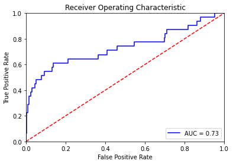
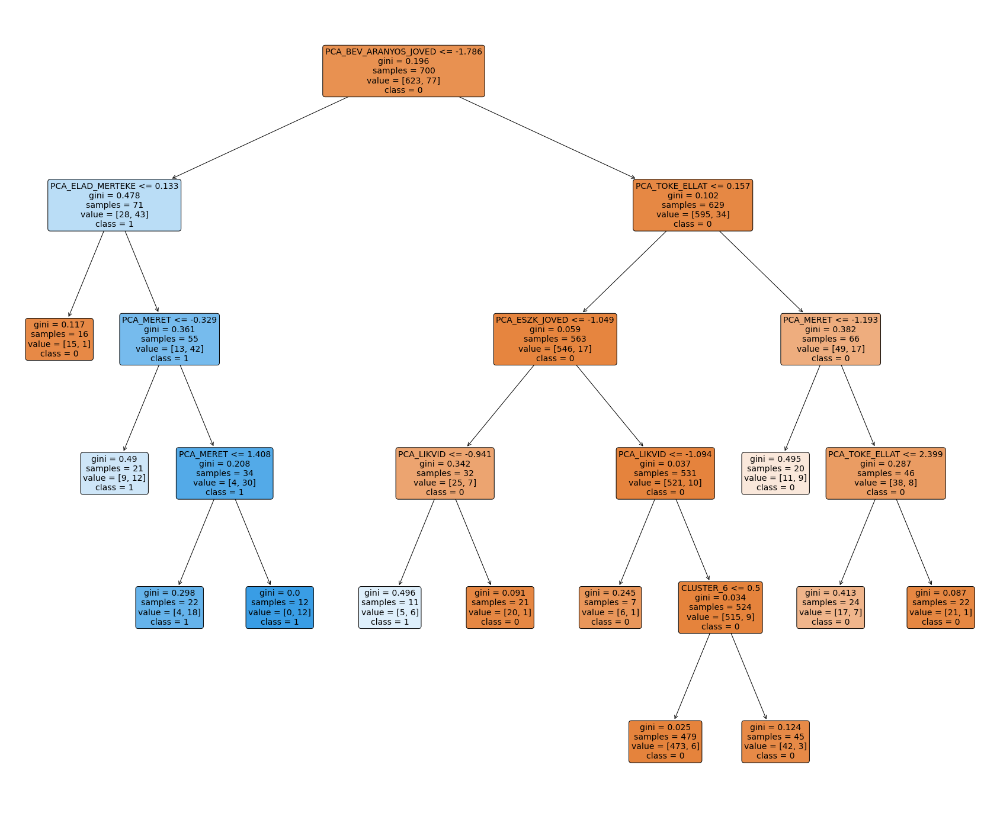
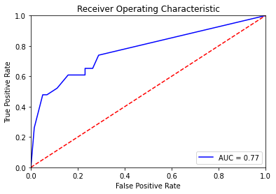

Foltányi Kolos

# Csődelőrejelzés Többáltozós Statisztikai Módszerekkel
A csődelőrejelzés alapvető célja csődvalószínűség, illetve fizetőképességet kifejező score becslése az egyes megfigyelésekhez a magyarázó változók (pénzügyi mutatók) és a csődeseményt kifejező bináris célváltozó felhasználásával.

## Csődmodell fejlesztés és értékelés
A modellfejlsztés során a csődmodellezési adatbázison a korábban megképzett 1/0 csődesemény célváltozó felhasználásával két statisztikai módszerrel készítünk csődelőrejelzési modellt. Az elkészített modelleket a ROC görbe és a klasszifikációs mátrix vizsgálatával értékeljük.

**1. Logisztikus regressziós modell készítése**<br>
**2. A regressziós modell értékelése**<br>
**3. Döntési fa készítése**<br>
**3. A döntési fa értékelése**

A modellek input változóiként az előző lépésben képzett főkomponenseket és a klaszterelemzés eredményeként előállt kategóriaváltozót használjuk fel. Ezeket az adokat a `variable` változóba olvassuk be. A modellek tanításához szükségünk lesz továbbá a célváltozóra, amit az eredeti adatbázisból olvasunk be a `target` változóba.


```python
from sklearn.model_selection import train_test_split
from sklearn.linear_model import LogisticRegression
from sklearn.tree import DecisionTreeClassifier
from sklearn.tree import plot_tree
from sklearn.metrics import classification_report
from sklearn.metrics import confusion_matrix
from sklearn import preprocessing
import matplotlib.pyplot as plt
import numpy as np
import pandas as pd


target = pd.read_excel('database.xlsx', index_col=0).loc[:,'CSOD']
variables = pd.read_excel('clustered.xlsx')
```

A `CLUSTER` kategóriaváltozó modellekben való használatához az egyes osztályokhoz dummy változókat kell létrehoznunk. Ez azt jelenti, hogy a 10 szintű kategóriaváltozónkat 10 db bináris változóvá alakítjuk, ahol az egyes oszlopok azt jelzik, hogy az adott kategóriába tartozik-e a rekord vagy sem (1/0).


```python
names = [f'CLUSTER_{i+1}' for i in range(10)]

dummies = pd.get_dummies(variables['CLUSTER'], columns=names)

variables.drop(['CLUSTER'], axis=1, inplace=True)

for i, name in enumerate(names):
    variables[name] = dummies[i]

variables.info()
```

    <class 'pandas.core.frame.DataFrame'>
    RangeIndex: 1000 entries, 0 to 999
    Data columns (total 17 columns):
     #   Column                 Non-Null Count  Dtype  
    ---  ------                 --------------  -----  
     0   PCA_ESZK_JOVED         1000 non-null   float64
     1   PCA_BEV_ARANYOS_JOVED  1000 non-null   float64
     2   PCA_ELAD_MERTEKE       1000 non-null   float64
     3   PCA_TOKE_ELLAT         1000 non-null   float64
     4   PCA_LIKVID             1000 non-null   float64
     5   PCA_MERET              1000 non-null   float64
     6   PCA_FEDEZETTSEG        1000 non-null   float64
     7   CLUSTER_1              1000 non-null   uint8  
     8   CLUSTER_2              1000 non-null   uint8  
     9   CLUSTER_3              1000 non-null   uint8  
     10  CLUSTER_4              1000 non-null   uint8  
     11  CLUSTER_5              1000 non-null   uint8  
     12  CLUSTER_6              1000 non-null   uint8  
     13  CLUSTER_7              1000 non-null   uint8  
     14  CLUSTER_8              1000 non-null   uint8  
     15  CLUSTER_9              1000 non-null   uint8  
     16  CLUSTER_10             1000 non-null   uint8  
    dtypes: float64(7), uint8(10)
    memory usage: 64.6 KB


## 1. Logisztikus Regresszió
Először kialakítjuk a tanuló és teszt halmazokat a hozzájuk tartozó célváltozókkal együtt:


```python
X_train, X_test, y_train, y_test = train_test_split(variables, target, test_size=0.3)
```

Ezután létrehozzuk a logisztikus regressziós modellt:


```python
logreg = LogisticRegression()
logreg.fit(X_train, y_train);
```

A regressziós modell együtthatói a következők lettek:


```python
coefs = logreg.coef_[0]
pd.DataFrame(coefs, index=variables.columns, columns=[ 'COEF'])
```


<div>
<table class="dataframe">  <thead>
    <tr style="text-align: right;">
      <th></th>
      <th>COEF</th>
    </tr>
  </thead>
  <tbody>
    <tr>
      <th>PCA_ESZK_JOVED</th>
      <td>0.041804</td>
    </tr>
    <tr>
      <th>PCA_BEV_ARANYOS_JOVED</th>
      <td>-0.731400</td>
    </tr>
    <tr>
      <th>PCA_ELAD_MERTEKE</th>
      <td>0.241388</td>
    </tr>
    <tr>
      <th>PCA_TOKE_ELLAT</th>
      <td>-0.114717</td>
    </tr>
    <tr>
      <th>PCA_LIKVID</th>
      <td>-0.402002</td>
    </tr>
    <tr>
      <th>PCA_MERET</th>
      <td>0.287746</td>
    </tr>
    <tr>
      <th>PCA_FEDEZETTSEG</th>
      <td>0.052199</td>
    </tr>
    <tr>
      <th>CLUSTER_1</th>
      <td>0.018826</td>
    </tr>
    <tr>
      <th>CLUSTER_2</th>
      <td>0.238002</td>
    </tr>
    <tr>
      <th>CLUSTER_3</th>
      <td>-1.178728</td>
    </tr>
    <tr>
      <th>CLUSTER_4</th>
      <td>1.217429</td>
    </tr>
    <tr>
      <th>CLUSTER_5</th>
      <td>-0.492799</td>
    </tr>
    <tr>
      <th>CLUSTER_6</th>
      <td>0.925916</td>
    </tr>
    <tr>
      <th>CLUSTER_7</th>
      <td>-0.080629</td>
    </tr>
    <tr>
      <th>CLUSTER_8</th>
      <td>-1.056084</td>
    </tr>
    <tr>
      <th>CLUSTER_9</th>
      <td>0.203680</td>
    </tr>
    <tr>
      <th>CLUSTER_10</th>
      <td>0.203091</td>
    </tr>
  </tbody>
</table>
</div>


Látható, hogy míg az eladósodottság mértéke főkomponens pozitív együtthatót kapott (0.241388) a likviditás negatívat (-0.402002). Ez pénzügyi-szakmai megfontolásból is helyénvaló, hiszen a csődesemény valószínűségét az eladósodottság mértéke növeli, az jó fizetőképességet indikáló mutatók pedig csökkentik.

## 2. A Regressziós modell értékelése

A teszthalmaz változóihoz kiszámoljuk a prediktált csődeseményt indikáló célváltozót:


```python
y_pred = logreg.predict(X_test)
```

A modell értékeléséhez kiszámoljuk a pontosságot, melyet a sikeres becslések számának és az összes minta hányadosaként kapunk meg.


```python
conf = confusion_matrix(y_test, y_pred)
TN = conf[0,0]
TP = conf[1,1]
print(f'Accuracy: {(TP + TN) / len(y_test)}')
```

    Accuracy: 0.9133333333333333


Klasszifikációs mátrix:


```python
pd.DataFrame(conf, columns = ["Actual True", "Actual False"], index = ["Predicted True", "Predicted False"])
```


<div>
<table class="dataframe">  <thead>
    <tr style="text-align: right;">
      <th></th>
      <th>Actual True</th>
      <th>Actual False</th>
    </tr>
  </thead>
  <tbody>
    <tr>
      <th>Predicted True</th>
      <td>267</td>
      <td>2</td>
    </tr>
    <tr>
      <th>Predicted False</th>
      <td>24</td>
      <td>7</td>
    </tr>
  </tbody>
</table>
</div>


ROC görbe:


```python
from sklearn.metrics import roc_curve, auc
from sklearn.metrics import roc_auc_score

probs = logreg.predict_proba(X_test)[:,1]
fpr, tpr, threshold = roc_curve(y_test, probs)
roc_auc = auc(fpr, tpr)

plt.title('Receiver Operating Characteristic')
plt.plot(fpr, tpr, 'b', label = 'AUC = %0.2f' % roc_auc)
plt.legend(loc = 'lower right')
plt.plot([0, 1], [0, 1],'r--')
plt.xlim([0, 1])
plt.ylim([0, 1])
plt.ylabel('True Positive Rate')
plt.xlabel('False Positive Rate')
plt.show()
```





Összességében a 0.73-as AUC érték megfelelőnek tekinthető. A másodfajú hibák számát azonban tovább lehetne csökkenteni a regressziós paraméterek finomhangolásával.

## 3. Döntési fa

A döntési fák a megfigyeléseket oly módon csoportosítják, hogy a csoportokon belüli variancia minél kisebb, míg a csoportok közötti variancia minél nagyobb legyen. A döntési fa a legerősebb particionáló erővel rendelkező változók mentén épül fel.

A túl kevés elemszámot tartalmazó szegmensek elkerülése érdekében a szülő- és gyerekágak képezhetőségét paraméterezni szükséges. Ezt a `min_samples_split`, `min_samples_leaf` paraméterek állításával tudjuk megtenni. A paraméterek értékeit rendre a tanulási halmaz 4%- és 1%-ra állítjuk.


```python
min_split = int(len(X_train)*0.04)
min_leaf = int(len(X_train)*0.01)
print('min samples split: ', min_split)
print('min samples leaf: ', min_leaf)
```

    min samples split:  28
    min samples leaf:  7


A kiszámolt paraméterekkel létrehozzuk, majd a tanuló mintával felépítjük a döntési fát, melyenek mélységét maximum 5 szintre állítjuk:


```python
dectree = DecisionTreeClassifier(max_depth=5, min_samples_split=min_split, min_samples_leaf=min_leaf)
dectree = dectree.fit(X_train, y_train)
```

Az így kapott döntési fát az alábbi módon tudjuk ábrázolni:


```python
plt.figure(figsize=(30,25))
feature_cols = variables.columns.values
a = plot_tree(dectree, feature_names=feature_cols, class_names=['0','1'], filled=True, rounded=True, fontsize=14)
```





Nem meglepő módon a fa gyökere a bevétel arányos jövedelmezőségi főkomponens mentén ágazik el, mely a logisztikus regressziós modellünkben is szignifikáns változó volt.

## 4. A döntési fa értékelése

Az modell értékeléséhez, először a teszthalmaz változóin elvégezzük a predikciót a kapott fával:


```python
y_pred = dectree.predict(X_test)
```

Majd ki tudjuk számolni a modellünk pontosságát:


```python
conf = confusion_matrix(y_test, y_pred)
TN = conf[0,0]
TP = conf[1,1]
print(f'Accuracy: {(TP + TN) / len(y_test)}')
```

    Accuracy: 0.8966666666666666


Klasszifikációs mátrix:


```python
pd.DataFrame(conf, columns = ["Actual True", "Actual False"], index = ["Predicted True", "Predicted False"])
```


<div>
<table class="dataframe">  <thead>
    <tr style="text-align: right;">
      <th></th>
      <th>Actual True</th>
      <th>Actual False</th>
    </tr>
  </thead>
  <tbody>
    <tr>
      <th>Predicted True</th>
      <td>258</td>
      <td>19</td>
    </tr>
    <tr>
      <th>Predicted False</th>
      <td>12</td>
      <td>11</td>
    </tr>
  </tbody>
</table>
</div>


ROC görbe:


```python
probs = dectree.predict_proba(X_test)[:,1]
fpr, tpr, threshold = roc_curve(y_test, probs)
roc_auc = auc(fpr, tpr)

plt.title('Receiver Operating Characteristic')
plt.plot(fpr, tpr, 'b', label = 'AUC = %0.2f' % roc_auc)
plt.legend(loc = 'lower right')
plt.plot([0, 1], [0, 1],'r--')
plt.xlim([0, 1])
plt.ylim([0, 1])
plt.ylabel('True Positive Rate')
plt.xlabel('False Positive Rate')
plt.show()
```





A döntési fával a regressziós modelhez hasonló, annál valamilvel pontosabb eredményeket kaptunk. A fa pontosságát hasonlóan a regressziós modelhez, a képzési paraméterek hangolásával tovább lehetne javítani. A 0.77-es AUC érték azonban elfogadhatónak tekinthető.
